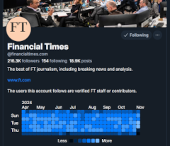

A Chrome extension rendering a summary of a user's posting frequency as a GitHub-style activity graph.

[Get it at the Chrome Web Store](https://chromewebstore.google.com/detail/bluesky-user-activity-gra/kbpfpbicdnmdfhklamjbpohahdjiljhe).





# Usage

The simplest way is to install it from 
[the Chrome Web Store](https://chromewebstore.google.com/detail/bluesky-user-activity-gra/kbpfpbicdnmdfhklamjbpohahdjiljhe).

## Load manually

Either method below will produce a folder that contains the extension:
load it using the ["Load an unpacked extension" method](https://developer.chrome.com/docs/extensions/get-started/tutorial/hello-world#load-unpacked).

### Download

Go to the [latest release](https://github.com/rpj/bsky-post-freq-extn/releases/latest) page and download the attached `BlueskyPostFrequencies_<version>.zip` in "Assets". 

Unzip it & the resulting folder is the extension.

### Build it yourself

From the project directory:

```shell
$ npm install
$ npm run build
```

This will produce a `dist/` folder, which is the extension.

# Acknowledgements 
Borrows **significantly** from:
* [@aliceweb.xyz](https://bsky.app/profile/aliceweb.xyz)'s [bluesky-heatmap](https://github.com/aliceisjustplaying/bluesky-heatmap) in [bsky.ts](./src/bsky.ts).
* [@mariohamann](https://bsky.app/profile/mariohamann.bsky.social)'s [activity-graph](https://github.com/mariohamann/activity-graph) in [activityGraph.js](./src/activityGraph.js).

❤️🙇 *Many* thanks!

## TBD

- [x] Use and show activity only for the chosen time window
- [ ] Inject summaries into Starter Packs
- [ ] Make it work properly in Firefox
- [ ] Add option to include reposts
- [x] Publish to Chrome Web Store!
